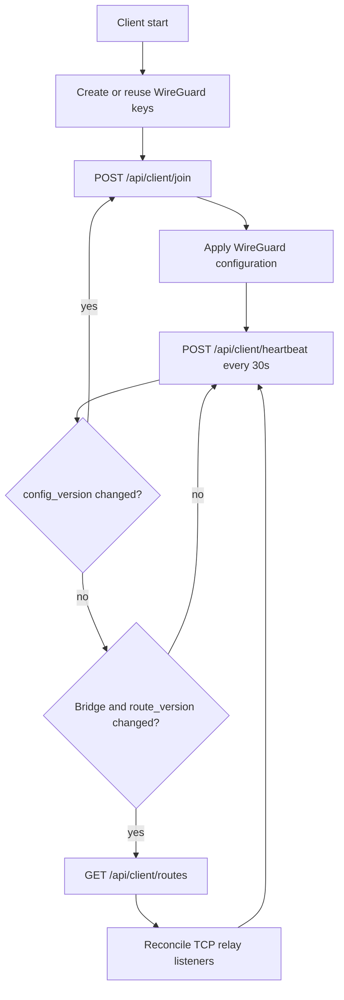

# Agent Protocol v0

本协议描述官方 Printf Client 启动、WireGuard 配置、heartbeat 和 Bridge route 同步行为。

普通用户不需要手动调用这些接口。

## 状态机



## `POST /api/client/join`

### 用途

- 首次启动注册 WireGuard public key。
- 获取 Client assigned IP 和 Node peers。
- 声明 capability。
- `config_version` 变化后重新同步 WireGuard 配置。

join 可能使控制面在 Node 上添加或更新 WireGuard peer，不应高频调用。

### 请求

```http
POST /api/client/join
Content-Type: application/json
```

Native/direct Client：

```json
{
  "token": "<client-token>",
  "client_pubkey": "<wireguard-public-key>",
  "capabilities": []
}
```

Docker Bridge Client：

```json
{
  "token": "<client-token>",
  "client_pubkey": "<wireguard-public-key>",
  "capabilities": [
    "bridge_tcp_relay_v1"
  ]
}
```

当前只接受 capability：

```text
bridge_tcp_relay_v1
```

未知 capability 会返回 `400`，不会被静默忽略。

### 安全 curl 示例

```bash
jq -n \
  --arg token "$PRINTF_TOKEN" \
  --arg pubkey "$PRINTF_CLIENT_PUBKEY" \
  '{token: $token, client_pubkey: $pubkey, capabilities: []}' |
curl --fail-with-body \
  -H 'Content-Type: application/json' \
  --data-binary @- \
  "${PRINTF_SERVER}/api/client/join"
```

命令历史只保存变量名，不保存 token 值。

### 响应

```json
{
  "nodes": [
    {
      "server_pubkey": "<node-wireguard-public-key>",
      "assigned_ip": "10.30.0.15/24",
      "endpoint": "203.0.113.10:51820",
      "allowed_ips": "10.30.0.0/24"
    }
  ]
}
```

字段：

| 字段 | 含义 |
| --- | --- |
| `server_pubkey` | Node WireGuard public key。 |
| `assigned_ip` | Client 在对应 WireGuard subnet 的地址。 |
| `endpoint` | Node 公网 UDP endpoint。 |
| `allowed_ips` | 该 peer 负责的 WireGuard subnet。 |

`nodes` 可能为空：

```json
{"nodes": []}
```

表示 token 有效，但当前没有可用 active Node。官方 Client 会停止并显示明确错误。

### 错误

| HTTP | 含义 |
| --- | --- |
| `400` | capability 不受支持或请求校验失败。 |
| `401` | token 无效。 |
| `409` | token 已被另一组 public key 的在线 Client 使用。 |
| `422` | JSON schema 不合法。 |

## `POST /api/client/heartbeat`

### 用途

- 更新 `last_seen`。
- 获取 `config_version`。
- 获取 `route_version`。
- Bridge Client 上报 relay 状态。

官方 Client 每 30 秒调用一次。控制面约 60 秒没有 heartbeat 会把 Client 视为离线。

### 请求

Native/direct Client：

```json
{
  "token": "<client-token>",
  "route_statuses": []
}
```

Bridge Client：

```json
{
  "token": "<client-token>",
  "route_statuses": [
    {
      "mapping_id": 17,
      "state": "active"
    },
    {
      "mapping_id": 18,
      "state": "unresolved",
      "error": "Docker alias app could not be resolved"
    }
  ]
}
```

允许的 `state`：

| State | 含义 |
| --- | --- |
| `listening` | relay listener 已建立，尚无成功目标连接。 |
| `active` | 至少完成过目标连接或正在工作。 |
| `unresolved` | alias 无法解析。 |
| `duplicate_alias` | alias 解析为多个不同 IP，Client 拒绝猜测。 |
| `connect_error` | relay 无法连接目标。 |
| `bind_error` | relay 无法绑定 WireGuard IP/port。 |

单次最多 512 条 status；`error` 最长 240 字符。服务端忽略不属于当前 Client 的 Mapping ID。

### 响应

```json
{
  "status": "ok",
  "config_version": 4,
  "route_version": 9
}
```

| 字段 | Client 行为 |
| --- | --- |
| `config_version` | 与上次值不同则重新 join。 |
| `route_version` | Bridge Client 与上次值不同则拉取 routes。 |

### 错误

| HTTP | 含义 |
| --- | --- |
| `401` | token 无效。 |
| `422` | request schema 不合法。 |

网络失败不代表 token 失效。官方 Client 记录错误并在下一 heartbeat 周期重试。

## `GET /api/client/routes`

仅供已经通过 join 注册 `bridge_tcp_relay_v1` 的 Bridge Client 使用。

Native Client 不调用该接口。

### 请求

```http
GET /api/client/routes
X-Printf-Token: <client-token>
```

```bash
curl --fail-with-body \
  -H "X-Printf-Token: ${PRINTF_TOKEN}" \
  "${PRINTF_SERVER}/api/client/routes"
```

### 响应

```json
{
  "version": 9,
  "routes": [
    {
      "mapping_id": 17,
      "listen_port": 20017,
      "target_host": "app",
      "target_port": 8080
    }
  ]
}
```

数据路径：

```text
Node -> Client WireGuard IP:20017 -> TCP relay -> app:8080
```

Client 必须把 listener 绑定到 assigned WireGuard IP，而不是 Docker bridge 的所有地址。

### Snapshot 规则

`routes` 是完整 snapshot，不是增量事件：

- 新 route：建立 listener。
- 目标变化：更新 relay target。
- snapshot 中消失：停止 listener。
- 重复 `mapping_id`：拒绝 snapshot。
- 重复 `listen_port`：拒绝 snapshot。

### 错误

| HTTP | 含义 |
| --- | --- |
| `403` | token 无效。 |
| `409` | Client 未注册 Bridge capability。 |
| `500` | active bridge Mapping 缺少 relay port。 |

## 兼容性建议

第三方 Client 应：

- 持久化 WireGuard key，不要每次启动生成新 key；
- 严格拒绝未知 capability 配置；
- 忽略 response 中未知的新增字段；
- 对 Node subnet 去重；
- 对 route snapshot 做 mapping ID 和 port 唯一性校验；
- 不把 token、private key 或完整 config 写进日志；
- 在写入新 WireGuard config 失败时显式退出或保留错误状态；
- 不实现“解析失败后猜一个 IP”的静默 fallback。
